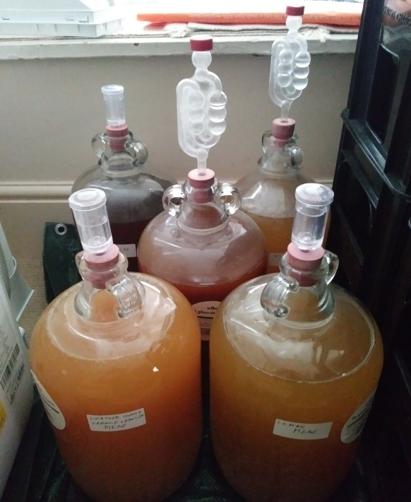
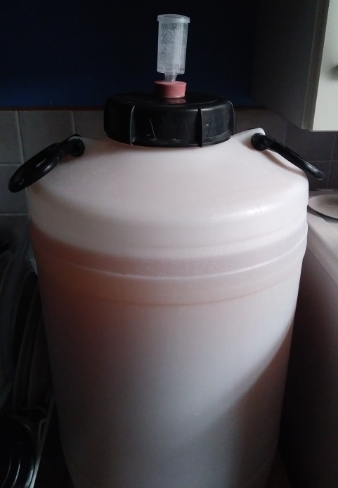

# Brewing

This is a repository of my brewing experiments and experiences. I do not guarantee the accuracy of anything here and any attempt to apply this information is made at your own risk, but it WorkedForMe(TM) (except where noted).

* [Ingredients](Ingredients.md)
* [Equipment](Equipment.md)
* [Process](Process.md)

## Recipes

All of these are based on the above process. The instructions are mostly just an aid to memory for me.

* [My Standard Bulk Cider](Cider/BulkCider.md)
* [Treacle Cider](Cider/TreacleCider.md)

* [My Standard Bulk Mead](Mead/BulkMead.md)
* [Lemon Mead](Mead/LemonMead.md)
* [Maple and Ginger Mead](Mead/MapleMead.md) (experimental)
* [Spiced Mead](Mead/SpicedMead.md) (experimental)
* [English Heather honey, Orange and Ginger Mead](Mead/HeatherOrangeGingerMead.md) (experimental)

## Logs

* [Mead batches](Mead/Log.md)
* [Cider batches](Cider/Log.md)

## General Notes

* Brewing cider and mead is really really easy.
  * Bottling is really boring though.
* Adding lots of honey to something forgives a multitude of sins.

## Sources of Ingredients

* Apple juice found in supermarkets and intended for drinking as-is _will_ work for cider, but ensure that it's pure juice.
  * Pure juice plus antioxidants (eg. ascorbic acid) is fine.
  * Drinking juice tends to lack tannins, which would give it a dry or sharp taste. I add tea to try to work around this.
  * Drinking juice tends to lose a lot of flavour during fermentation (depending on yeast, etc). Backsweetening may be desired. Adding a bit of molasses gives the cider extra flavour too.

* Honey is best bought in bulk, from a responsible source.
  * My current source (UK): https://www.payneshoney.co.uk/
  * We should seek to support beekeepers as much as possible, particularly if using a lot of honey.
  * But I did start out using supermarket honey and I still use it for small spur-of-the-moment experiments.

* Blackstrap molasses can be easily found in health food shops and on Amazon.
  * The type I usually use is [this one](https://www.amazon.co.uk/Meridian-Organic-Molasses-350-Pack/dp/B0069RWQN2).
  * It's slightly bitter and has a distinctive burnt-sugary smell.

## The Brewery

